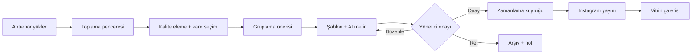

# Tasarım Dokümanı — Futbol Okulu Sosyal Medya Motoru

## 1. Özet

Antrenörün yüklediği idman fotoğraflarını yönetici onaylı Instagram paylaşımlarına dönüştüren motor. İlk kullanıcı pilot bir kulüp; hedef, ürünü farklı kulüplere satmak. Veri modeli ilk günden çok kiracılı; arayüz MVP'de tek kulüp gibi görünür.

## 2. MVP kapsamı

| Bileşen | MVP | Not |
| --- | --- | --- |
| Antrenör yükleme PWA'sı | Var | Grup seç, foto seç, gönder |
| İşleme hattı | Var | Kalite eleme, kare seçimi, 4:5 kırpma, şablon |
| AI metin üretimi | Var | Kulüp tonunda Türkçe metin + hashtag |
| Onay kuyruğu ve zamanlama | Var | Her paylaşım yönetici onayından geçer |
| Instagram post yayını | Var | Tek platform |
| Tema ayarları | Var | Logo, renkler, kulüp adı |
| Minimal rıza kaydı | Var | Çıkarılamaz |
| Vitrin sayfası | Var | Tanıtım, iletişim, otomatik galeri |
| Story, yüz algılama/bulanıklaştırma | Faz 2 | |
| Aidat, veli girişi, yoklama, ödeme | Yok | |
| Facebook, TikTok, YouTube | Yok | |

## 3. Roller

| Rol | Yetki | Arayüz |
| --- | --- | --- |
| COACH (antrenör) | Kendi gruplarına foto + idman notu yükler | PWA |
| CLUB_ADMIN (yönetici) | Onay, düzenleme, zamanlama, tema, öğrenci/rıza listesi, antrenör yönetimi | Panel (mobil öncelikli) |
| Veli | Rıza formunu doldurur | Tek kullanımlık imzalı link, giriş yok |
| PLATFORM_ADMIN | Tenant açar, Meta uygulamasını ve altyapıyı yönetir | MVP'de CLI/seed betiği; arayüz Faz 3 |

## 4. Uçtan uca akış

Taslak durum makinesi: `COLLECTING → PROCESSING → PENDING_REVIEW → APPROVED → SCHEDULED → PUBLISHING → PUBLISHED`; yan dallar `REJECTED`, `FAILED` (tekrar denenebilir).

**İzin verilen geçişler** (listede olmayan her geçiş reddedilir; tek doğrulama noktası `packages/shared/src/state/`):

| Kaynak | Hedef | Tetikleyici |
| --- | --- | --- |
| `COLLECTING` | `PROCESSING` | Toplama penceresi kesimi |
| `PROCESSING` | `PENDING_REVIEW` | İşleme tamamlandı |
| `PROCESSING` | `FAILED` | Kalıcı işleme hatası |
| `PENDING_REVIEW` | `PROCESSING` | Birleştir/Ayır (worker yeniden düzenler); yönetici düzenlemesi varsa önce uyarı ve yönetici teyidi (§8) |
| `PENDING_REVIEW` | `APPROVED` | Yönetici onayı (`approvedAt`, `approvedBy` yazılır) |
| `PENDING_REVIEW` | `REJECTED` | Yönetici reddi (isteğe bağlı not) |
| `APPROVED` | `SCHEDULED` | Yayın zamanı atanır |
| `APPROVED`, `SCHEDULED` | `PENDING_REVIEW` | Düzenleme ya da ilgili grupta rızanın geri alınması (`approvedAt`, `approvedBy` temizlenir; yeniden onay gerekir) |
| `SCHEDULED` | `PUBLISHING` | Zamanlayıcı; yalnızca `approvedAt`/`approvedBy` doluysa |
| `PUBLISHING` | `PUBLISHED` | Yayın başarılı |
| `PUBLISHING` | `FAILED` | Kalıcı yayın hatası |
| `FAILED` | `SCHEDULED` | Yalnızca yeniden deneme eylemiyle; yalnızca yayın aşamasında başarısız olmuş ve onay bilgileri dolu taslaklar |
| `FAILED` | `PROCESSING` | Yalnızca yeniden deneme eylemiyle; işleme aşamasında başarısız olmuş taslaklar |

`REJECTED` ve `PUBLISHED` son durumlardır.

## 5. Antrenör yükleme PWA'sı

- Link veya QR ile dağıtılır, ana ekrana eklenir.
- Akış: grup seç → fotoğrafları seç → (isteğe bağlı) idman notu → gönder.
- Orijinal çözünürlük; S3'e presigned doğrudan yükleme; ağ koparsa yeniden deneme.
- Grup ve tarih etiketi yükleme anında gelir.
- Seçilen grupta rızasız çocuk varsa uyarı gösterilir.
- İdman günü yükleme yapılmadıysa antrenöre hatırlatma (basit, e-posta). İdman günleri grup başına `Group.trainingDays` alanında tutulur ve tenant saat dilimine göre değerlendirilir.

## 6. İşleme hattı ve gruplama

**Saat dilimi:** tüm gün, tarih ve saat hesapları tenant saat dilimine göre yapılır (`TenantSettings.timezone`, varsayılan `Europe/Istanbul`). Veritabanında zamanlar UTC saklanır. Bu kural "günün yüklemeleri", toplama kesimi, yayın saat aralığı, günlük post sınırı ve hatırlatmalar için geçerlidir.

**Toplama penceresi:** tenant ayarıdır ve tenant başına işler (grup başına değil). Ya son yüklemeden N dakika sonra (varsayılan 90) ya da sabit bir saatte (örn. 20:00) kesilir. Kesim anında tenant'ın o günkü tüm yüklemeleri, tüm gruplarıyla birlikte tek havuzda değerlendirilir.

**Adımlar:**
1. Kalite puanı: netlik (Laplacian varyansı), parlaklık, pozlama. Eşik altı elenir.
2. Yakın kopya eleme: perceptual hash.
3. Grup başına en iyi 5-8 kare.
4. Feed için 4:5 akıllı kırpma.
5. Tenant şablonu ile render: logo, tarih, grup etiketi, kapak karesi, çok gruplu carousel'de grup ara kapakları.

**Gruplama önerisi:**

| Durum | Öneri |
| --- | --- |
| Tek grup | Tek post |
| Birden fazla grup, toplam öğe ≤ 10 | Birleşik carousel, grup ara kapaklı |
| Birden fazla grup, toplam öğe > 10 | Ayrı postlar, günlere yayılır |

**Öğe sayımı:** carousel başına en fazla 10 öğe. Kapak ve grup ara kapakları da öğe sayılır (sınır Instagram'ındır). Örnek: 2 grup × 5 fotoğraf + 1 kapak + 2 ara kapak = 13 öğe, dolayısıyla ayrı postlar. Tek grupta en fazla 8 fotoğraf + kapak = 9 öğe olduğu için sınır aşılmaz. Tenant ayarı "günde en fazla X post" kuyruğu sınırlar. Yöneticinin birleştir/ayır seçimleri kaydedilir (ileride varsayılanı ayarlamak için).

## 7. AI metin motoru

**Girdiler:** seçilen kareler (vision), grup, tarih, gün bağlamı, antrenör notu, tenant ton profili, son 30 metin.

**İskelet:** giriş cümlesi → idman içeriği (1-2 cümle) → zaman zaman çağrı (kayıt, "link bio'da") → sabit + döngüsel hashtag.

**Korkuluklar (üretim sonrası programatik kontrol):**
- Tenant öğrenci listesindeki hiçbir isim metinde geçmez; geçerse yeniden üret, yine geçerse taslağı uyarıyla işaretle.
- Çocuklar arası kıyas / performans yargısı yok (prompt kuralı + eval).
- Emoji üst sınırı (ton profilinden, varsayılan 4).
- Son 30 metnin açılış cümleleriyle yüksek benzerlik varsa yeniden üret.
- Instagram metin ve hashtag sınırlarına uyum.

**Ton profili (tenant):** ön ayar (`ENERGETIC`, `WARM`, `FORMAL`), örnek metinler, yasaklı ifadeler, sabit hashtag'ler, emoji sınırı. Pilot: `ENERGETIC`. Yöneticinin onay ekranındaki metin düzeltmeleri örnek havuzuna eklenir.

## 8. Onay kuyruğu

- Taslak hazır olunca yöneticiye bildirim (MVP: e-posta + panel rozeti; push Faz 2).
- Önizleme Instagram görünümünde (carousel kaydırma, metin).
- Eylemler: Onayla (en uygun saat dilimine zamanlanır, tenant ayarı, varsayılan 19:00-21:00), Düzenle (metin, kare çıkar/sırala, kapak seç, metni yeniden üret), Birleştir/Ayır, Reddet (isteğe bağlı not).
- **Birleştir/Ayır ve yönetici düzenlemeleri:** etkilenen taslaklardan birinde yönetici düzenlemesi (elle değiştirilmiş metin, çıkarılmış/sıralanmış kare, seçilmiş kapak) varsa, onay ekranı işlemi başlatmadan önce hangi düzenlemelerin kaybolacağını gösteren bir uyarı açar; yönetici teyit etmeden `PENDING_REVIEW → PROCESSING` geçişi olmaz. Kare düzenlemeleri yeniden düzenlemede kaybolur. Yönetici tarafından düzenlenmiş metin mümkünse korunur, yeniden üretilmez: metnin ait olduğu kaynak taslak işlem sonrası tek bir hedef taslağa eşlenebiliyorsa ve o hedef taslağa başka bir düzenlenmiş metin eşlenmiyorsa metin o hedef taslağa taşınır (ör. birleştirmede yalnızca bir kaynak taslağın metni düzenlenmişse). Aksi halde (ör. ayırmada metin birden fazla hedefe dağılıyorsa) metin yeniden üretilir; bu durum uyarıda belirtilir.
- Onaysız kalan taslak için hatırlatma.
- Rızasız çocuğu olan grupta taslak üstünde uyarı. Böyle bir taslak, yönetici açık bir onay kutusunu işaretlemeden onaylanamaz ("Bu karelerde yayın rızası olmayan çocuk bulunmadığını kontrol ettim"). Onay kutusu, onaylayan kişi ve zaman `AuditLog`'a yazılır.
- Yayınlanan her içeriğin denetim kaydı (hangi fotoğraf, hangi grup, hangi post); kaldırma talebinde ilgili postlar bulunabilir.

## 9. Instagram yayını

- "Instagram API with Instagram Login"; hesap Business veya Creator.
- Pilot: kulüp hesabı Meta uygulamasına test kullanıcısı olarak eklenir. Satış öncesi business verification + advanced access (paralel başlatılır).
- API görseli herkese açık URL'den çeker: işlenmiş JPEG'ler süreli presigned URL ile sunulur.
- Akış: container oluştur → (carousel için çocuk container'lar) → durum sorgula → publish.
- Hata yönetimi: geçici hatalarda üstel geri çekilmeli yeniden deneme; kalıcı hatada `FAILED` + yöneticiye bildirim.
- Token yenileme işi zamanlanmış çalışır; token veritabanında şifreli.
- Güncel limitler ve izin adları uygulama sırasında Meta dokümanından teyit edilir; kod sabitleri tek bir config dosyasında.

## 10. Rıza ve KVKK

- Gruplara göre öğrenci listesi (ad, soyad, grup) ve rıza kaydı.
- Veliye tek kullanımlık imzalı link; formda ayrı onaylar: `photoAllowed`, `socialMediaAllowed`, `websiteAllowed`, `faceVisibleAllowed`. Onay zamanı, IP ve metin versiyonu saklanır. Rıza metni dört izni ayrı ayrı açıklar; metin her değiştiğinde versiyonu artar.
- **"Rızasız çocuk" tanımı:** Instagram için rıza kaydı olmayan ya da `photoAllowed` veya `socialMediaAllowed` değeri `false` olan öğrenci. Vitrin için rıza kaydı olmayan ya da `photoAllowed` veya `websiteAllowed` değeri `false` olan öğrenci.
- Rıza geri alınabilir. Geri alındığında:
  - O öğrencinin grubuna ait `APPROVED` ve `SCHEDULED` taslaklar `PENDING_REVIEW`'e geri çekilir ve uyarıyla işaretlenir; `PENDING_REVIEW` taslaklarda uyarı gösterilir.
  - Daha önce yayınlanmış ve o grubu içeren postlar panelde **"kontrol edilmeli"** listesine düşer. Yönetici her birini inceleyip kapatır; bu eylem `AuditLog`'a yazılır.
- **Vitrin galerisi:** yayınlanan post, içerdiği gruplarda `websiteAllowed` açısından rızasız çocuk yoksa galeriye otomatik düşer. Varsa galeriye düşmez ve yönetici ayrıca onaylar (onay `AuditLog`'a yazılır).
- Yüz tanıma yok. Faz 2'de rızasız çocuğu olan grupta tüm yüzler varsayılan bulanık (yalnızca yüz algılama).
- Kulüp veri sorumlusu, platform veri işleyen. Silme/erişim talepleri için yönetici aracı (öğrenci verisini ve bağlı rıza kayıtlarını dışa aktar/sil).
- Metinlerde çocuk ismi yok.
- **Saklama süreleri** (tenant ayarıyla değiştirilebilir, `TenantSettings`):
  - Orijinal fotoğraflar, içinde yer aldıkları post yayınlandıktan 90 gün sonra silinir.
  - Reddedilen taslaklar ve bunlara bağlı orijinal ile türev görseller, ret tarihinden 30 gün sonra silinir.
  - Silme işi zamanlanmış çalışır ve her çalışmasında `AuditLog`'a özet yazar (PII içermez).
- Türev görsellerden EXIF ve konum verisi temizlenir.
- **Instagram'dan kaldırma:** API bir postu silmeyi desteklemiyorsa (M7'de doğrulanır), kaldırma talebinde yönetici postu Instagram uygulamasından elle siler. Bu adım `docs/RUNBOOK.md`'de tarif edilir; panel `AuditLog` üzerinden ilgili postları listeler.

## 11. Çok kiracılı tema sistemi

- Tenant tema token'ları: `primary`, `secondary`, türetilmiş tonlar, `onPrimary` vb. Hiçbir renk kodda sabit değil.
- Logo yüklenince renk önerisi (logo paletinden çıkarım).
- Türetme: açık/koyu tonlar, hover, üstündeki yazı rengi otomatik.
- WCAG kontrast kontrolü; okunmaz kombinasyon otomatik düzeltilir.
- Post şablonları Satori ile tenant token'larından render edilir.
- Vitrin sayfası: sabit düzen, varyantlar (hero stili, bölüm aç/kapa). Tanıtım, iletişim, otomatik galeri (galeriye yalnızca `websiteAllowed` kuralını geçen postlar düşer, bkz. §10).
- Tema modülü (`packages/shared/src/theme/`) web ile Satori şablonları arasında ortak sözleşmedir; ikisi de aynı token türetme fonksiyonlarını kullanır.
- Tenant adresleme MVP: alt alan adı (`<slug>.<platform-domain>`); özel alan adı Faz 3.

## 12. Fazlar

| Faz | Kapsam |
| --- | --- |
| Faz 1 | Bu dokümandaki MVP |
| Faz 2 | Yüz algılama + bulanıklaştırma, story, maç günü/skor kartı şablonları, etkileşim istatistikleri, push bildirim |
| Faz 3 | Self-servis kurulum sihirbazı, abonelik/ödeme, özel alan adı, şablon mağazası |
